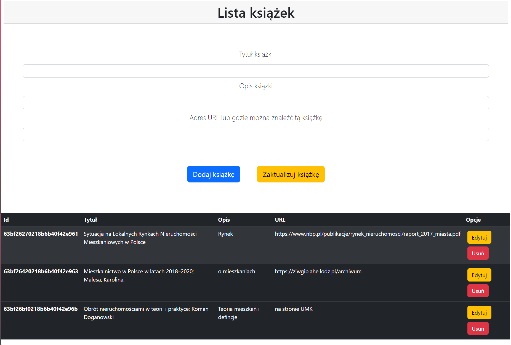
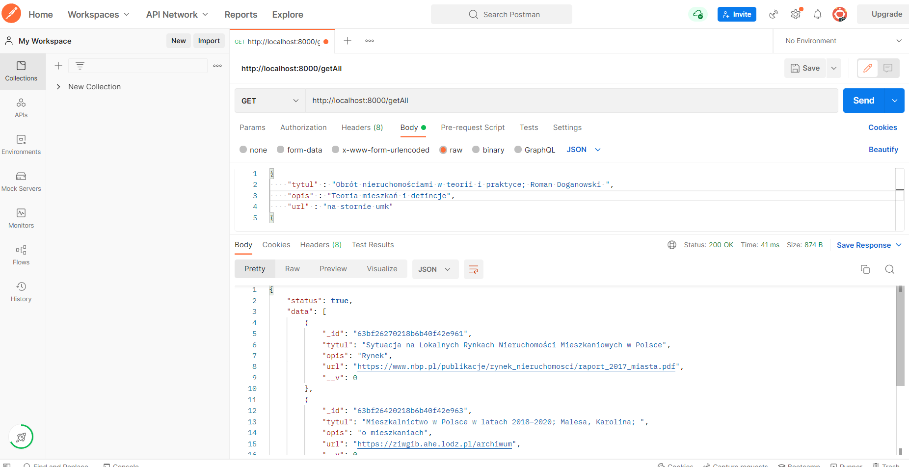
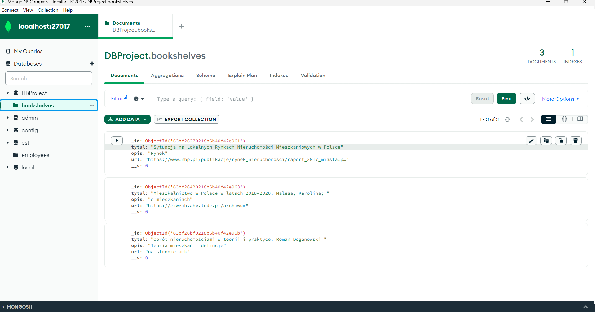

# MERN Bookshelf

## Spis treści
* [Charakterystyka pprogramowania ](#charakterystyka-oprogramowania)
* [Prawa autorskie i wymagane licencje  ](#prawa-autorskie-i-wymagane-licencje)
* [Specyfikacja wymagań ](#specyfikacja-wymagań)
* [Architektura systemu   ](#architektura-systemu )
* [Setup   ](#setup )
* [Zdjęcia   ](#zdjęcia )

## Charakterystyka oprogramowania
MERN Bookshelf – strona webowa, służąca do przechowywania informacji na temat książek oraz informacji gdzie możemy je znaleźć

Technologia wykorzystana do stworzenia projektu: 
* Stos techologiczny: Javascript, bootstrap, express, node, react
* Program: Visual Studio Code, MongoDB, Postman

## Prawa autorskie i wymagane licencje
Uznanie Autorstwa 4.0 Międzynarodowe (CC by 4.0) – pozwala na kopiowanie, zmienianie, rozprowadzanie, przedstawianie i wykonywanie utworu jedynie pod warunkiem oznaczenia autorstwa.

## Specyfikacja wymagań
| Id | Nazwa | Opis | Priorytet |
| ------------- | ------------- | ------------- | ------------- |
| 1 | Połączenie serwera z bazą danych   | Serwer powinien łączyć się z bazą danych w MongoDB oraz wyświetlać komunikaty o przebiegu połączenia   | 1  |
| 2  | Połączenie frontendu z backendem   | By strona internetowa mogła działać, aplikacja powinna łączyć się z serwerem i zbierać dane z bazy danych | 1  |
| 3  | Wyświetlanie danych  | By nasza strona posiadała pełną funkcjonalność musi wyświetlać dane na stronie        | 1  |
| 4  | Tworzenie, modyfikacja I usuwanie książek | Aplikacja powinna dawać możliwość modyfikacji, tworzenia oraz usuwania książek w strukturze CRUD      | 1  |

## Architektura systemu
* Node,js  ( https://nodejs.org/en/docs/ )
* React i Bootstrap ( https://cdn.jsdelivr.net/npm/bootstrap@5.1.3/dist/css/bootstrap.min.css )
* Visual Studio Code
* MongoDB 

## Setup

Link do projektu:
https://drive.google.com/file/d/1a4NOs95U63xjqdpq9kwkF5mMRA3252SW/view?usp=sharing

Aby uruchomić aplikacje w folderze backend należy urchomić terminal i wpisać komende:

node server.js

Następnie trzeba urchomić terminal w frontend i urchomić aplikacje z polecenie:

npm start

## Zdjęcia

Widok aplikacji:

W postmanie możemy przetestować nasze API:

Aplikacja łączy się z bazą danych MongoDB, w której możemy też wyświetlić dane:

